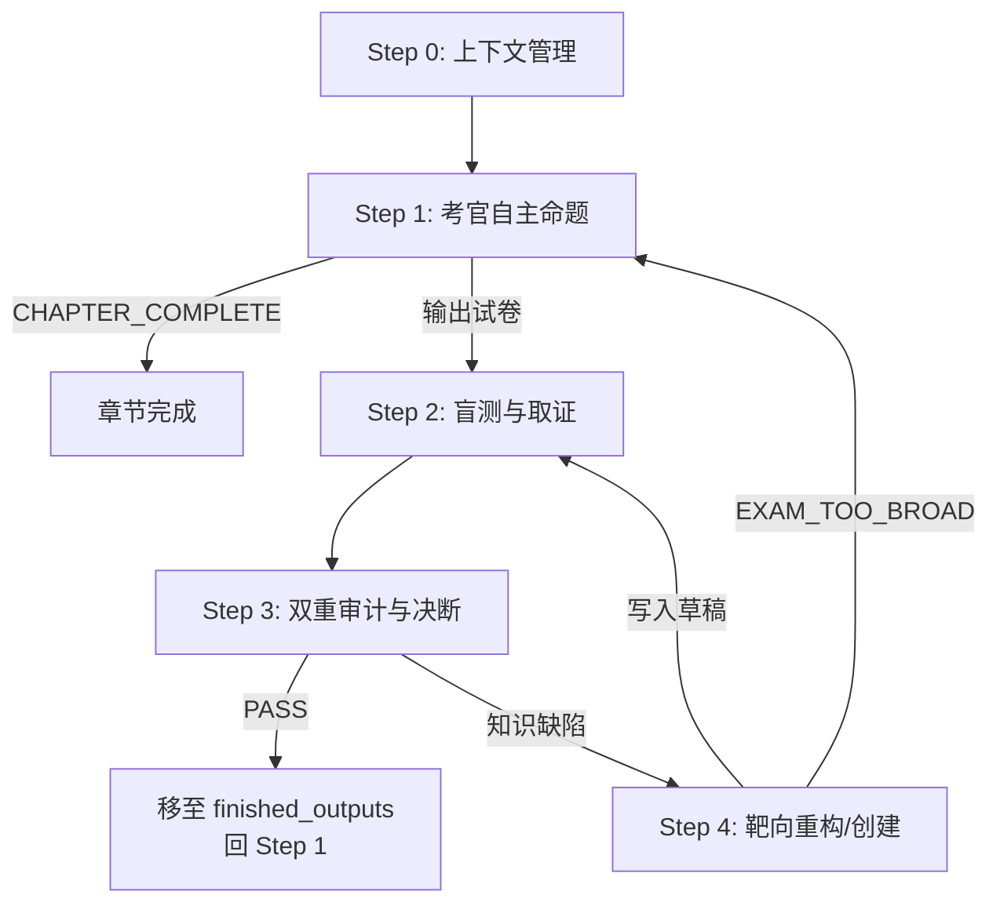

# T.R.E.E. — 以考促写的自动化教材生成流水线

[](LICENSE)
[](pyproject.toml)

T.R.E.E.（**T**extbook **R**efinement & **E**nhancement **E**ngine）是一套资料驱动的多智能体自动化教材生成与审核系统。它以**"以考促写"（Exam-Driven Writing）**为核心范式——用户上传资料后，PaddleOCR 与 Archivist 先生成结构化资料，考官再基于资料自主决定知识点并命题，学生盲测，根据考试结果驱动草稿生成——实现教学材料的**无人值守、迭代自举式**质量打磨。

## 核心思想

传统的教材审核依赖领域专家逐字审阅，成本高、速度慢。T.R.E.E. 将内容生成与审核建模为一个闭环系统：

1. **资料摄入**：PaddleOCR 识别用户上传文件，Archivist 清洗为 `source_materials/<collection>/*.md`
2. **考官**基于结构化资料自主决定下一个知识点并自创考试（固定 3 题，约 40% 分值可用前序知识作答，约 60% 需新知识）
3. **学生**在"零基础"设定下，仅凭前序已通过文件（及当前草稿，若存在）作答
4. **考官**对答卷进行双重审计——正确性 + 忠实度（学生的每步推理是否都能在草稿中找到依据？）
5. 若发现知识断层，考官生成《Bottleneck Report》，**教师**靶向重构草稿后重新接受**同一份试卷**的测试

这个循环对每个知识点自动迭代，直至通过满分阈值。当考官判定章节无新知识可考时，输出 `CHAPTER_COMPLETE`，章节完成。

## 架构：三权分立

```
                    ┌──────────────────────────────┐
                    │     TreeEngine 独立编排器       │
                    │     编排 Auto-Loop             │
                    └──────┬───────┬───────┬────────┘
                           │       │       │
              ┌────────────┼───────┼───────┼──────────────┐
              │            │       │       │              │
              ▼            ▼       ▼       ▼              │
    ┌─────────────┐  ┌─────────┐  ┌─────────────┐        │
    │  Examiner   │  │ Student │  │   Writer    │        │
    │  (考官/裁判) │  │(学生/盲测)│  │ (教材作者)   │        │
    │  opus       │  │ haiku   │  │  haiku       │        │
    │  + 上下文保留 │  │ + 预读协议 │  │ + 上下文保留    │        │
    └──────┬──────┘  └────┬────┘  └──────▲───────┘        │
           │              │              │                │
           │ Step 1 & 3   │  Step 2     │  Step 4         │
           │ 组卷 + 审计   │  盲测取证     │  CREATE/OPTIMIZE│
           │              │              │                │
           └──────────────┴──────────────┘                │
                 Bottleneck Report                       │
                                                        │
          Step 0: 上下文管理 (每次新文件前强制执行) ◄───────┘
```

| 角色 | 引擎内置 Prompt | 模型 | 协议 | 职责 |
|------|------|------|------|------|
| **Examiner** | `tree.agents.prompts.EXAMINER_PROMPT` | Opus | 上下文保留 | Step 1 自主命题组卷；Step 3 双重审计（正确性+忠实度）、生成 Bottleneck Report、判定 PASS/FAIL |
| **Student** | `tree.agents.prompts.STUDENT_PROMPT` | Haiku | 预读协议 + 每次全新启动 | 零基础设定，先按编号顺序读完所有相关文件再作答，按 Evidence → Deduction → Gap 三段式输出 |
| **Writer** | `tree.agents.prompts.WRITER_PROMPT` | Haiku | 上下文保留 | 接收 Bottleneck Report，CREATE 或 OPTIMIZE 草稿，执行规模检查（超 1000 行则输出 `EXAM_TOO_BROAD`） |
| **Archivist** | `tree.agents.prompts.ARCHIVIST_PROMPT` | Haiku | 摄入阶段调用 | 将 PaddleOCR 原始结果清洗、纠错、重组为教材可用 Markdown |

### 为什么模型选择是故意的

- **Examiner 用 Opus**：审计逻辑复杂，需要最高推理能力来发现知识越界（Knowledge Bleed）
- **Student 用 Haiku**：模拟的是零基础学生——他不应该比教材"更聪明"。用 Opus 当学生会破坏对抗的平衡
- **Writer 用 Haiku**：重构是对症下药，Haiku 的速度优势允许快速迭代

### 上下文管理策略

同一文件循环期间：
- **Examiner 保留上下文**：考官记住自己命的题和审过的答卷，每轮审计可追踪修复进展
- **Writer 保留上下文**：writer 记住上一轮的草稿和知识缺陷，理解历史修复轨迹
- **Student 每次全新启动**：每轮调用均不携带之前上下文，预读协议保证它每次从文件系统重新加载全部知识，杜绝跨轮记忆污染

## Auto-Loop 协议



### Step 0 — 上下文管理

每个新文件处理前，总场控从 `pipeline-state.json` 读取当前章节的 `files_completed` 列表，确定下一个文件序号。考官和 writer 在同一文件循环期间保留上下文；学生每次全新启动。

### Step 1 — 考官自主命题

Examiner 读取全部前序已完成文件，理解知识边界，自主确定下一个知识点名称并命题。命题遵循以下规则：

- **RAG 辅助定位**：若本地向量索引可用，引擎会同时检索 `content_kind=source` 的源资料片段和 `content_kind=finished` 的已完成教材片段，并连同路径传给考官；检索失败不阻塞主流程
- **固定 3 题**：每份试卷恰好 3 道顶层题目（每题可含子问题）
- **40 分首轮目标**：设计试卷使得仅凭前序已完成文件可答对约 40% 分值（约 40/100），剩余约 60% 需新知识。首个知识点无前序文件时此规则不适用
- **禁止泄题公式**：试卷不得给出前序文件中不存在的公式作为"提示"或"已知条件"——纯数值常量（如 $g = 9.8\,\mathrm{m/s^2}$）和几何参数（如 $\theta = 30^\circ$）允许，但公式必须来自已完成文件
- **禁止摘要输出**：`[Blind_Exam]` 和 `[Answer_Key]` 必须输出完整文本，不得以摘要、大纲或要点替代

输出格式：`## [Next_Knowledge_Point]` + `## [Blind_Exam]` + `## [Answer_Key]`。若章节无新知识可考，输出 `CHAPTER_COMPLETE`。

**若从 `EXAM_TOO_BROAD` 退回**：考官复用原有知识点名称，但缩减试卷范围（删除或替换导致膨胀的题型），减少单次迭代的知识覆盖面。

### Step 2 — 盲测与取证

Student 遵循 **预读协议（Pre-Reading Protocol）**：先按编号顺序读完所有前序已完成文件，再读当前草稿（若存在），之后才开始作答。每道题按三段式输出：
- **RAG 辅助检索**：若本地向量索引可用，引擎会用试卷和学生指令检索 `content_kind=finished` 的已完成教材。当前草稿不写入 RAG，始终以全文方式直接提供给 Student；检索范围不包含未学习的 source 原始资料
- **[Evidence N]**：从文件中逐条提取的相关证据
- **[Deduction]**：逐步推导，每步标注引用来源
- **[Gap]**：逻辑缺口声明（Gap α：当前草稿缺失 / Gap β：所有草稿均缺失）

### Step 3 — 双重审计与决断

Examiner 交叉比对标准答案、草稿文本、学生答卷，验证学生引用的真实性，生成 **Bottleneck Report**：

| 判定 | 条件 | 路由 |
|------|------|------|
| **PASS** | 全部答案正确 · 零知识越界 · 零逻辑缺口 · 零知识缺陷 | 草稿移至 `/finished_outputs`，更新 `files_completed`，回 Step 1。若 `/drafts` 中无草稿（题目全可凭前序知识解答）：不产生新文件，回 Step 1 |
| **知识缺陷** | 草稿缺少本应覆盖的知识点（首轮无草稿时所有缺口均为知识缺陷） | → Step 4。**不重新组卷**，下一轮 Step 2 用同一份试卷 |

> **注意**：协议已简化为单一缺陷类型。所有知识缺口统一归类，由 writer 在 Step 4 修复。

**PASS 时无草稿的特殊情况**：若学生凭前序已完成文件即可答对所有题目（无增量知识点需要覆盖），则不产生新文件，不追加 `files_completed`。考官将自然发现无新知识可考，输出 `CHAPTER_COMPLETE`。

### Step 4 — 靶向重构 / 创建

Writer 根据 Bottleneck Report 执行 **CREATE**（草稿不存在）或 **OPTIMIZE**（草稿存在）。

若本地向量索引可用，引擎会用 `知识点名称 + Bottleneck Report` 检索两类上下文：`content_kind=source` 的原始资料片段，以及 `content_kind=finished` 的已完成教材片段。Writer 仍以 Bottleneck Report 为修复目标，RAG 片段只作为可引用的补充证据。

**规模检查（EXAM_TOO_BROAD 熔断）**：落笔前，若覆盖所有知识缺陷预计产出 **>1000 行**，则拒绝写入，输出 `EXAM_TOO_BROAD` + 造成膨胀的具体缺陷项。总场控将膨胀列表传回考官，退回 Step 1 重新命题（缩减试卷范围）。草稿文件保持原样不动。

正常情况下，writer 写入草稿并 Git 提交后，**强制退回 Step 2**（同一份试卷，学生重新阅读全部文件后作答）。

## 关键设计决策

### 以考促写（Exam-Driven Writing）

无预定义知识点清单。流水线从已完成的最后一个文件出发，考官自主决定下一个知识点并命题，学生考试，根据考试结果生成草稿，循环至考官判定章节完成。这避免了传统"知识清单驱动"模式下知识点粒度和范围难以把控的问题。

### 零基础学生（Zero Baseline）

Student 没有预装任何知识——不懂代数、不懂三角函数、不懂物理。每一条推理必须能从教材草稿或前序已通过文件中找到原文依据。这使得考官可以发现两种深层次问题：

- **知识越界（Knowledge Bleed）**：学生用到了草稿中没有的概念但仍答对了 → 说明 LLM 的训练数据填补了缺口 → 草稿缺失关键内容
- **逻辑缺口（Logic Gap）**：学生因草稿不完整而在某一步推导卡死 → 精确定位草稿的断裂点（Gap α：当前草稿缺失 / Gap β：所有草稿均缺失）

### 上下文保留策略

同一文件循环期间，考官和 writer 保留上下文（考官记住命题和审过的答卷，writer 记住上一轮的草稿和缺陷），学生每次全新启动（预读协议从文件系统重新加载全部知识）。这既保证审计和修复的连续性，又避免跨轮记忆对学生盲测的污染。

### 预读协议（Pre-Reading Protocol）

学生在作答前，必须先按编号顺序读完所有前序已完成文件，再读当前草稿（若存在）。此举模拟真实学习者"读完前面的章节再面对后面的习题"的认知顺序，避免因跳过前置阅读而误报逻辑缺口。

### 强制退回 Step 2（Same Exam Retest）

Step 4 重构草稿后，不回到 Step 1 重新命题，而是使用**同一份试卷**从 Step 2 重测。这确保修复是针对同一套考题的——学生须在修复后的草稿中重新寻找证据来作答同一道题，考官直接对比两轮答卷验证缺陷是否已被修复。

### 40 分首轮目标（40-Point First-Round Target）

考官设计试卷时，约 40% 的分值应可凭前序已完成文件作答（验证知识衔接顺畅），约 60% 需新知识（暴露知识缺陷，驱动草稿创建）。首个知识点无前序文件时此规则不适用。

### 禁止泄题公式（No Formula Handout Rule）

试卷不得给出前序文件中不存在的公式作为"提示"。若草稿尚未教授某个公式，学生必须在考试中暴露这一缺口——用提示掩盖它会导致 知识缺陷未被检测到，草稿质量下降。

### EXAM_TOO_BROAD 熔断机制

若 writer 预估修复当前所有知识缺陷将产生超过 1000 行的草稿，则拒绝写入并发出 `EXAM_TOO_BROAD` 信号。这防止单次迭代的知识覆盖面过广，倒逼考官缩减试卷范围、拆分知识点。

### 忠实度 > 正确率

传统评估只看答案对不对。T.R.E.E. 的核心洞察是：**学生答对但推理来源不在教材中，比答错更危险。** 这意味着教材存在知识断层，只是碰巧被模型的训练数据掩盖了。

## 目录结构

```
T.R.E.E/
├── AGENTS.md                          # 仓库级 agent 工作说明
├── tree/                              # 独立编排引擎（pip install -e .）
│   ├── cli.py                         # tree-run 命令行入口
│   ├── engine.py                      # 核心编排循环
│   ├── config.py                      # .env 配置加载
│   ├── agents/                        # Agent 调用构建器 + 内置 prompts.py
│   ├── state/                         # Pydantic 模型 + pipeline-state.json
│   ├── io/                            # 文件读写 + Git 操作
│   ├── observability/                 # trace.jsonl + 迭代限制 + 重试降级
│   ├── deepseek/                      # LLM 客户端（Pro/Flash 降级）
│   └── ingest.py                      # PaddleOCR → Archivist → Markdown 集成摄入
├── rag/                               # RAG 向量检索
│   ├── server.py                      # Qwen3 本地嵌入服务 (FastAPI)
│   ├── embed.py                       # 嵌入客户端
│   └── chunker.py                     # Markdown 语义切分器
├── ingest/                            # 文档摄入流水线
│   ├── pipeline.py                    # 主编排器
│   ├── ocr_engine.py                  # PaddleOCR-VL 1.5 API 客户端
│   └── extractors/                    # PDF/图片/DOCX 提取器
├── scripts/                           # 启动脚本
│   ├── start-embed-server.sh          # Mac/Linux 嵌入服务启动
│   ├── start-embed-server.bat         # Windows 嵌入服务启动
│   ├── run-ingest.sh                  # 文档摄入
│   └── setup-embedding.sh             # LM Studio 嵌入服务（旧）
├── raw_materials/                      # （运行时）用户上传的原始资料
├── source_materials/                   # （运行时）OCR + Archivist 后的结构化资料
├── drafts/                            # （运行时）待打磨的教材草稿
├── finished_outputs/                  # （运行时）满分通过的定稿
└── pipeline-state.json                # （运行时）全局进度状态
```

> `raw_materials/`、`source_materials/`、`drafts/`、`finished_outputs/`、`pipeline-temp/`、`pipeline-state.json` 均为运行时产物，已由 `.gitignore` 排除。

## 快速开始

### 前置条件

- Python 3.12+
- Git

### 1. 安装

```bash
git clone <repo-url> && cd T.R.E.E.
python -m venv .venv && source .venv/bin/activate   # Windows: .venv\Scripts\Activate.ps1
pip install -e ".[rag]"                              # 含 RAG 依赖；仅引擎: pip install -e .
```

### 2. 配置

编辑 `.env`，填入 LLM API 密钥：

```bash
# 至少设置一个默认密钥或角色专属密钥
LLM_API_KEY=sk-...
LLM_BASE_URL=https://api.openai.com/v1
LLM_MODEL=gpt-4o

# PaddleOCR（已内置，无需修改）
PADDLEOCR_API_URL=https://paddleocr.aistudio-app.com/api/v2/ocr/jobs
PADDLEOCR_API_TOKEN=your-token
```

### 3. 启动嵌入服务

```bash
# macOS / Linux
./scripts/start-embed-server.sh

# Windows
scripts\start-embed-server.bat
```

### 4. 运行流水线

```bash
# 将原始课件/作业放入 raw_materials/<collection>/ 后直接启动
# run 会先自动执行 OCR → Archivist → source_materials → RAG embedding
# source Markdown 是中间产物，成功 embedding 后会自动删除
tree-run run

# 也可以手动摄入指定文件或目录
tree-run ingest --input test/课件 --collection 化学平衡

# 调试摄入：仅 OCR，不调用 Archivist LLM
tree-run ingest --input test/课件 --collection 化学平衡 --no-structure

# 查看状态
tree-run status

# 从断点恢复
tree-run resume
```

## RAG 向量检索：本地 Qwen3 Embedding + Qdrant

T.R.E.E. 使用本地 **Qwen3-Embedding-4B-Q8_0** 嵌入服务和 embedded Qdrant 为资料建立向量索引。`tree-run run` 每次启动都会先检查 `raw_materials/` 是否有新增或变更资料；若有，会先完成 OCR、Archivist 结构化和 source embedding。只有当全部 `source_materials/<collection>/*.md` 都完成 embedding 后，引擎才会进入以考促写循环。

source Markdown 只是入库中间产物，成功 embedding 后会删除；后续 Examiner/Writer 通过 RAG payload 读取 source chunk，不再读取 `source_materials/` 文件。`finished_outputs/` 原文件会保留，但 Student/Examiner/Writer 运行时也只读取其 embedding 后的 RAG chunk，不再读取 finished Markdown 全文。

### 架构

```
tree engine
    │
    ▼
rag/embed.py  ──HTTP──▶  rag/server.py (FastAPI)
    │                          │
    │                          ▼
    │                    llama-cpp-python
    │                          │
    │                          ▼
    │                    Qwen3-Embedding-4B-Q8_0 GGUF
    │
    ▼
tree/rag/client.py ──▶ ./rag-store (embedded Qdrant)
```

### 启动服务

```bash
# macOS / Linux
./scripts/start-embed-server.sh

# Windows
scripts\start-embed-server.bat
```

服务启动后监听 `http://localhost:8788`。

### 验证

```bash
# 健康检查
curl http://localhost:8788/health

# 测试嵌入
curl -X POST http://localhost:8788/v1/embeddings \
  -H "Content-Type: application/json" \
  -d '{"model":"Qwen3-Embedding-4B-Q8_0","input":"化学平衡状态是正逆反应速率相等的状态"}'

# Python 客户端
python -c "from rag.embed import EmbeddingClient; print(EmbeddingClient().health_check())"
```

### 环境变量配置

在 `.env` 中添加（可选，默认值已内置）：

```bash
# 嵌入服务地址（默认 http://localhost:8788）
EMBED_API_URL=http://localhost:8788
# 嵌入模型名称（默认 Qwen3-Embedding-4B-Q8_0）
EMBED_MODEL=Qwen3-Embedding-4B-Q8_0
# 服务端口（默认 8788）
EMBED_PORT=8788
```

### 常见问题

**Q: 首次启动很慢（几分钟）？**
A: 首次运行需从 HuggingFace 下载 Qwen3-Embedding-4B GGUF 权重。后续启动会从本地缓存加载。

**Q: HuggingFace 下载失败 / 网络受限（GFW）？**
A: 在 `.env` 中设置代理：
```bash
HTTP_PROXY=http://127.0.0.1:7890    # Clash 默认端口
HTTPS_PROXY=http://127.0.0.1:7890
```
或使用 HuggingFace 镜像（需代理能访问 huggingface.co）：
```bash
HF_ENDPOINT=https://hf-mirror.com
```
启动脚本会自动读取 `.env` 中的代理设置。

**Q: 摄入时报 embedding 连接失败？**
A: 先启动 `./scripts/start-embed-server.sh`，或者临时使用 `tree-run ingest ... --no-index` 跳过索引。

## 适用场景

- **教材/课程编写**：迭代打磨教学内容直至每个推导步骤都可被零基础学生复现
- **技术文档审查**：验证文档是否包含读者所需的全部前置知识
- **AI 教育培训数据**：检测训练材料的逻辑完整性和知识依赖链路
- **任何需要"确保读者仅凭文本就能学会"的场景**

## 许可证

MIT License

## 作者

Waylon524

---

*"教育不是注满一桶水，而是点燃一把火。" — W.B. Yeats*

*T.R.E.E. 确保那桶水一滴不漏，火才有空间燃烧。*
